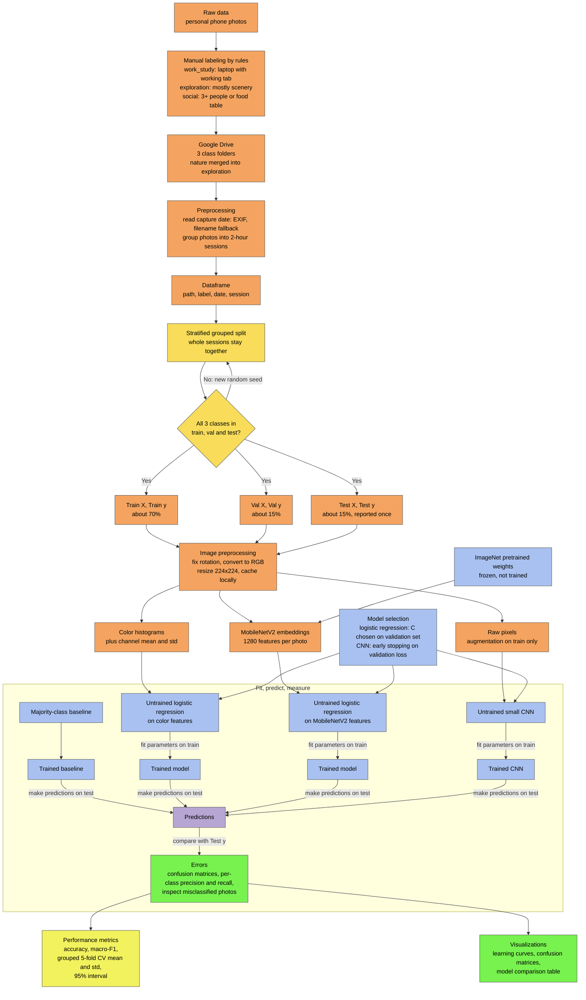

# CS156-Assignment
Coursework for CS156. ML pipelines exploring personal data. More details coming soon! 
## Pipeline

```mermaid
flowchart TB
  A["Raw data<br/>personal phone photos"] --> B["Manual labeling by rules<br/>work_study: laptop with working tab<br/>exploration: mostly scenery<br/>social: 3+ people or food table"]
  B --> C["Google Drive<br/>3 class folders<br/>nature merged into exploration"]
  C --> D["Preprocessing<br/>read capture date: EXIF, filename fallback<br/>group photos into 2-hour sessions"]
  D --> E["Dataframe<br/>path, label, date, session"]
  E --> F["Stratified grouped split<br/>whole sessions stay together"]
  F --> G{"All 3 classes in<br/>train, val and test?"}
  G -- "No: new random seed" --> F
  G -- Yes --> TR["Train X, Train y<br/>about 70%"]
  G -- Yes --> VA["Val X, Val y<br/>about 15%"]
  G -- Yes --> TE["Test X, Test y<br/>about 15%, reported once"]

  TR & VA & TE --> P["Image preprocessing<br/>fix rotation, convert to RGB<br/>resize 224x224, cache locally"]

  P --> F1["Color histograms<br/>plus channel mean and std"]
  P --> F2["MobileNetV2 embeddings<br/>1280 features per photo"]
  P --> F3["Raw pixels<br/>augmentation on train only"]
  IW["ImageNet pretrained weights<br/>frozen, not trained"] --> F2

  MS["Model selection<br/>logistic regression: C chosen on validation set<br/>CNN: early stopping on validation loss"]

  subgraph FIT["Fit, predict, measure"]
    BL["Majority-class baseline"]
    M1["Untrained logistic regression<br/>on color features"]
    M2["Untrained logistic regression<br/>on MobileNetV2 features"]
    M3["Untrained small CNN"]
    BL --> T0["Trained baseline"]
    M1 -- "fit parameters on train" --> T1["Trained model"]
    M2 -- "fit parameters on train" --> T2["Trained model"]
    M3 -- "fit parameters on train" --> T3["Trained CNN"]
    T0 & T1 & T2 & T3 -- "make predictions on test" --> PR["Predictions"]
    PR -- "compare with Test y" --> ER["Errors<br/>confusion matrices, per-class precision and recall,<br/>inspect misclassified photos"]
  end

  F1 --> M1
  F2 --> M2
  F3 --> M3
  MS --> M1
  MS --> M2
  MS --> M3

  ER --> PM["Performance metrics<br/>accuracy, macro-F1,<br/>grouped 5-fold CV mean and std,<br/>95% interval"]
  ER --> VZ["Visualizations<br/>learning curves, confusion matrices,<br/>model comparison table"]

  classDef data fill:#F4A460,stroke:#555,color:#000
  classDef model fill:#A9C1F0,stroke:#555,color:#000
  classDef pred fill:#B7A6D4,stroke:#555,color:#000
  classDef out fill:#77F24F,stroke:#555,color:#000
  classDef metric fill:#F2F25E,stroke:#555,color:#000
  classDef step fill:#F8DC5A,stroke:#555,color:#000
  class A,B,C,D,E,TR,VA,TE,P,F1,F2,F3 data
  class IW,MS,BL,M1,M2,M3,T0,T1,T2,T3 model
  class PR pred
  class ER,VZ out
  class PM metric
  class F,G step
```
